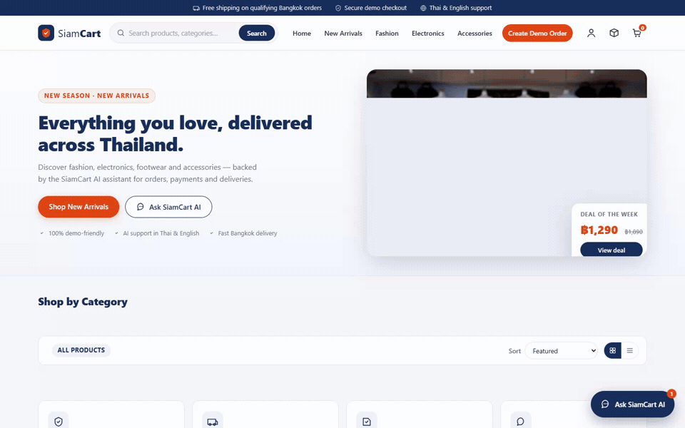
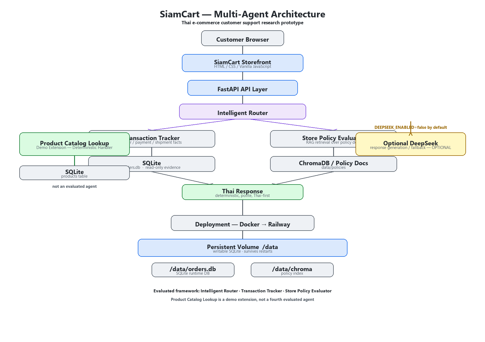

# SiamCart

**LLM-Powered Multi-Agent Customer Support Framework for Thai E-commerce**


**Live Demo:** https://web-production-1ea79.up.railway.app
**GitHub:** https://github.com/chen64811-ship-it/siamcart-ai-ecommerce

SiamCart is a deployed research prototype for Thai e-commerce customer support.
It combines deterministic transaction processing, policy retrieval, persistent
multi-turn context, and an optional LLM layer inside a FastAPI-based multi-agent
framework.

## Live Demo



Try it: https://web-production-1ea79.up.railway.app

## Architecture



The evaluated framework (M.Sc. thesis study) consists of three agents:

- **Intelligent Router** — deterministic intent classification and routing.
- **Transaction Tracker** — SQLite-backed order/payment/shipment facts.
- **Store Policy Evaluator** — RAG retrieval over store policy documents.

Additional components:

- **Product Catalog Lookup** — a demo extension with a deterministic handler,
  not a fourth evaluated agent.
- **Optional DeepSeek** — optional response-generation/fallback layer on top of
  the deterministic pipeline.

Deployment:

- Docker containerization
- Railway hosting with a persistent `/data` volume
- SQLite database and ChromaDB index stored on the persistent volume

## Demo Customer Journey

Normal path:

```
Browse Products
→ Add to Cart
→ Checkout
→ Demo Payment
→ My Orders
→ Ask AI
→ Simulate Shipment
→ Tracking
→ Mark Delivered
```

Cancellation path:

```
Processing + Not Shipped
→ Cancel Order
→ Simulated Refund
→ Stock Restored
```

No real payment or courier transaction occurs.

## What This Project Demonstrates

- FastAPI API design
- deterministic business logic
- SQLite transactions and persistent state
- multi-turn conversational context
- multi-agent routing
- RAG-based store policy retrieval
- simulated payment/refund/shipment workflows
- Docker containerization
- Railway deployment with persistent volume
- automated focused and regression testing

## Reliability

- Demo stabilization focused tests: 21 passed
- Shipment lifecycle focused tests: 21 passed
- Relevant regression suites: 95 passed
- Public Railway smoke journey passed
- SQLite state persisted after Railway service restart
- Browser console: 0 critical JavaScript errors during final public smoke

> The demo extensions were added after the frozen thesis evaluation and were
> not part of the original 120-scenario comparison.

## Research Scope

- Research prototype — built for an M.Sc. thesis study on multi-agent customer
  support; not a production store.
- Simulated payment — no real money is transferred.
- Simulated refund — no real money is transferred.
- Simulated shipment and tracking — no real courier integration, no real
  tracking API, no ETA prediction.
- No production authentication (research prototype only).
- Optional DeepSeek layer — deterministic pipeline works without it; the LLM
  is an optional response-generation/fallback layer.
- Customer-facing responses are generated in Thai by a deterministic
  SQLite-backed pipeline, with optional LLM formatting when configured.

## Tech Stack

- Python
- FastAPI
- SQLite
- ChromaDB
- DeepSeek (optional LLM formatter)
- Vanilla JavaScript
- HTML/CSS

## Local Setup

```bash
python -m venv .venv
```

Windows:

```bat
.venv\Scripts\activate
```

Linux/macOS:

```bash
source .venv/bin/activate
```

Install dependencies and create your environment file:

```bash
pip install -r requirements.txt
copy .env.example .env        # Windows
cp .env.example .env          # Linux/macOS
```

Start the server. Primary:

```bash
python run.py server
```

Fallback (identical application, uvicorn directly):

```bash
python -m uvicorn app.api.server:app --host 0.0.0.0 --port 8000
```

Open http://localhost:8000 — the database, schema, products, and demo seed
data initialize automatically on first startup.

## Environment Variables

All configuration is read from `.env` (see `.env.example` — variable names
only, no secrets). The important ones:

| Variable | Default | Purpose |
| --- | --- | --- |
| `DEEPSEEK_ENABLED` | `false` | Enable the optional LLM formatter |
| `DEEPSEEK_API_KEY` | *(empty)* | DeepSeek API key (never committed) |
| `DEEPSEEK_MODEL` | `deepseek-v4-flash` | LLM model name |
| `DEEPSEEK_BASE_URL` | `https://api.deepseek.com` | LLM endpoint |
| `DEEPSEEK_TIMEOUT_SECONDS` | `8` | LLM timeout |
| `EMBEDDING_MODEL` | sentence-transformers paraphrase-multilingual-MiniLM-L12-v2 | RAG embedding model |

## Tests

Focused suites (temporary SQLite only — the real runtime database is never
touched by tests):

```bash
.venv\Scripts\python.exe -m pytest tests/test_demo_shipment_lifecycle.py -v
```

## Project Layout

```
app/
  agents/        # router, transaction tracker, policy evaluator, orchestrator
  api/           # FastAPI app and storefront routes
  db/            # SQLite schema, migrations, product seed
  models/        # Pydantic request models
  services/      # deterministic product catalog lookup
  static/        # frontend JS/CSS/images
  templates/     # HTML pages
data/
  policies/      # store policy documents (required by the app)
tests/           # focused pytest suites
```
